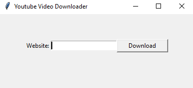

# YouTube Video Downloader

This is a simple YouTube video downloader application implemented in Python using the Pytube library and Tkinter for the user interface. It allows users to download videos from YouTube by providing the video URL.



## Table of Contents
- [Description](#description)
- [Installation](#installation)
- [Usage](#usage)
- [License](#license)

## Description

The YouTube Video Downloader application enables users to download videos from YouTube by entering the URL of the video they wish to download. It utilizes the Pytube library to fetch the video stream with the highest resolution and downloads it to the user's local machine.

## Installation

1. Ensure you have Python installed on your system.
2. Install the Pytube library using the following command:

```sh
pip install pytube
```

## Usage

1. Run the Python script in your preferred environment.
2. Enter the URL of the YouTube video you want to download in the provided entry field.
3. Click the "Download" button to initiate the download process.
4. Upon successful completion, the status label will display "Download is completed successfully".
5. If an error occurs during the download process, the status label will display the error message.

## License

This project is licensed under the MIT License.
